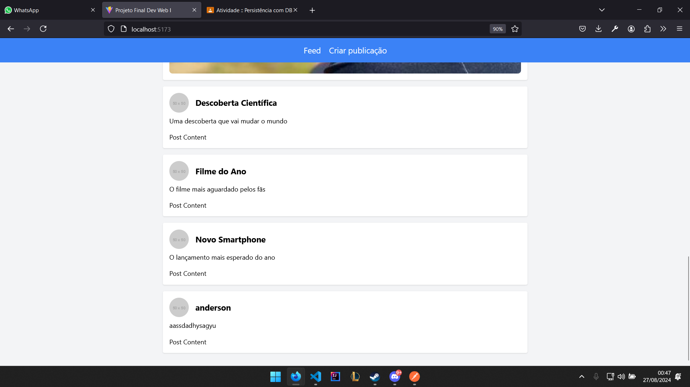

Aqui está a documentação completa em português para rodar o projeto:

---

# Apenas Fans

Este projeto foi desenvolvido para a disciplina de Tópicos Especiais em Computação. O objetivo é criar uma aplicação web onde artistas possam se conectar com seus fãs, proporcionando um espaço de interação e colaboração.




## Como rodar o projeto

### Pré-requisitos

Para rodar o projeto, você precisará ter as seguintes ferramentas instaladas em sua máquina:

- [Node.js](https://nodejs.org/en/)
- [Git](https://git-scm.com/)

### Passo a passo para rodar o projeto

#### 1. Clone o repositório

Abra o terminal e execute o comando abaixo para clonar o repositório do projeto:

```bash
git clone https://github.com/LuisFelipeRochaMartins/dev-web-app
```

#### 2. Acesse o diretório do projeto

Navegue até o diretório clonado:

```bash
cd apenas-fans
```

#### 3. Instale as dependências

Para instalar as dependências do projeto, execute o comando:

```bash
npm install
```

Isso instalará todas as dependências necessárias para o backend (Node.js) e o frontend (React).

#### 4. Configure o banco de dados

O projeto utiliza SQLite como banco de dados. Um arquivo `populate.js` foi incluído para popular o banco de dados com dados iniciais.

1. **Crie o banco de dados e as tabelas necessárias**:
   
   O projeto já inclui a criação das tabelas na inicialização do servidor. No entanto, é necessário rodar o script de população para inserir os dados iniciais:

   ```bash
   node populate.js
   ```

   Esse comando criará o banco de dados (`banco.db`) e inserirá os dados nas tabelas `users`, `categorias`, e `posts`.

#### 5. Execute o servidor backend

Para rodar o servidor backend, que servirá a API REST, execute o comando:

```bash
npm run server
```

O servidor será iniciado e rodará na porta `5000`. A API estará acessível em `http://localhost:5000`.

#### 6. Execute o frontend

Para rodar o frontend (React), execute o comando:

```bash
npm start
```

Isso abrirá a aplicação React em seu navegador padrão, acessível em `http://localhost:3000`.

### Estrutura do Projeto

- **Backend (Node.js)**:
  - As rotas para os cadastros de `users`, `categorias`, `posts` e outras funcionalidades estão no arquivo principal do servidor.
  - O script `populate.js` popula o banco de dados com dados iniciais.

- **Frontend (React)**:
  - O frontend inclui páginas para criar posts, visualizar o feed, relatórios, e um formulário de contato.
  - O código está escrito em TypeScript para maior segurança e clareza.

### Funcionalidades

1. **Três cadastros principais**:
   - `Users`: Cadastro de usuários.
   - `Categorias`: Cadastro de categorias.
   - `Posts`: Cadastro de posts que estão relacionados a categorias (mestre-detalhe).

2. **Mestre-detalhe**:
   - Os posts estão relacionados a uma categoria específica, selecionada no momento do cadastro do post.

3. **Combobox (Select)**:
   - Ao cadastrar um post, é possível selecionar a categoria através de um combobox.

4. **Relatório com Filtro**:
   - Relatórios de posts podem ser filtrados por categoria e exportados para PDF.

5. **Formulário de Contato**:
   - Um formulário simples para envio de mensagens por e-mail.

### Conclusão

Este projeto é um exemplo de aplicação web completa utilizando Node.js e React, com integração de banco de dados SQLite e geração de relatórios em PDF.